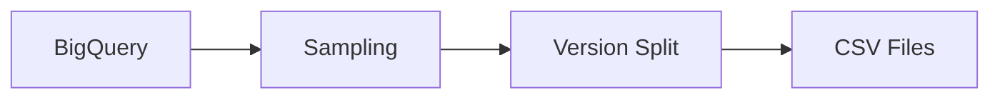
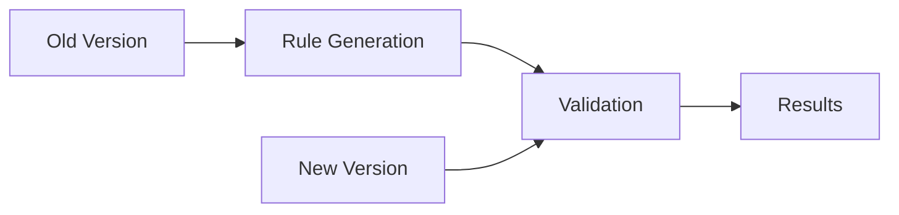

# Game Data Validation Automation System

## Overview
A comprehensive system for validating game event data across different versions. This system automates the process of extracting, comparing, and validating game data parameters, ensuring data quality and consistency between game versions.

## Table of Contents
- [Installation](#installation)
- [Quick Start](#quick-start)
- [System Architecture](#system-architecture)
- [Core Components](#core-components)
- [Data Flow](#data-flow)
- [Configuration](#configuration)
- [Usage Examples](#usage-examples)
- [Detailed Documentation](#detailed-documentation)
- [Validation Rules](#validation-rules)
- [Error Handling](#error-handling)
- [Contributing](#contributing)

## Installation

### Prerequisites
- Python 3.8+
- Google Cloud Platform account with BigQuery access
- Service account credentials for BigQuery

### Setup
1. Clone the repository:
```bash
git clone https://github.com/PeerPlayGames/data_validation_automation.git
cd data_validation_automation
```

2. Install dependencies:
```bash
pip install -r requirements.txt
```

3. Configure BigQuery credentials:
- Place your service account JSON file in the project root
- Update `config.json` with your project details

## Quick Start

### Basic Usage
```bash
# Run complete validation workflow
python run_validation.py --old-version 0.3615 --new-version 0.3621

# Skip specific steps
python run_validation.py --skip-extraction --old-version 0.3615 --new-version 0.3621
```

## System Architecture

### Directory Structure
```
data_validation/
├── run_validation.py         # Main orchestration script
├── create_csv.py            # Data extraction from BigQuery
├── compare_validate.py      # Version comparison logic
├── param_analysis/          # Core validation modules
│   ├── param_analyzer.py    # Parameter analysis
│   ├── param_definitions.py # Base parameter types
│   └── enhanced_param_definitions.py # Advanced validators
├── logs/                    # Analysis outputs
└── data/                    # CSV data storage
```

## File Documentation

### 1. run_validation.py
Main orchestration script that coordinates the entire validation workflow.

#### Key Features
- Configurable workflow execution
- Intelligent error handling
- Progress tracking and logging
- Resource management

#### Usage
```python
from run_validation import ValidationRunner

runner = ValidationRunner('config.json')
runner.extract_data('0.3615', '0.3621')
runner.run_validation()
runner.run_analysis()
```

### 2. create_csv.py
Handles data extraction from BigQuery with intelligent sampling.

#### Key Features
- Efficient data sampling
- Version-based filtering
- Memory-optimized processing
- Progress tracking

#### Implementation Details
```python
def extract_data_from_bigquery(old_version: str, new_version: str):
    """
    Extracts sampled data for two versions using FARM_FINGERPRINT
    for deterministic sampling.
    
    Sampling Logic:
    - Uses timestamp-based hashing for even distribution
    - Adjusts sampling rate based on data volume
    - Targets ~2M rows per version
    """
```

### 3. compare_validate.py
Implements the core validation logic for comparing versions.

#### Key Features
- Chunk-based processing
- Memory-efficient validation
- Comprehensive rule checking
- Detailed reporting

#### Validation Types
- Value set validation
- Pattern matching
- Range checking
- Type validation
- Custom validators

### 4. param_analysis/ Directory

#### param_analyzer.py
Analyzes parameter patterns and generates validation rules.

##### Key Features
- Automatic type detection
- Pattern recognition
- Constraint analysis
- Rule generation

#### param_definitions.py
Defines base parameter types and validation rules.

##### Parameter Types
- Fixed Set Parameters
- Constrained Range Parameters
- Pattern-Based Parameters
- Custom Types

#### enhanced_param_definitions.py
Implements advanced validation rules for specific fields.

##### Validator Types
1. **Timestamp Validators**
   - ISO Format: `YYYY-MM-DDThh:mm:ss[.fraction][timezone]`
   - Unix Milliseconds: Epoch-based validation
   - Unix Seconds: Range validation

2. **JSON Structure Validators**
   - Schema validation
   - Nested object validation
   - Array validation

3. **List Validators**
   - Simple lists
   - Nested structures
   - Type checking

## Data Flow

### 1. Data Extraction Phase


### 2. Validation Phase


## Configuration

### config.json
```json
{
    "bigquery": {
        "project_id": "your-project",
        "dataset_id": "your-dataset",
        "table_id": "your-table"
    },
    "validation": {
        "chunk_size": 10000,
        "output_dir": "data",
        "logs_dir": "logs"
    }
}
```

## Usage Examples

### 1. Basic Validation
```bash
python run_validation.py --old-version 0.3615 --new-version 0.3621
```

### 2. Custom Configuration
```bash
python run_validation.py --config my_config.json --old-version 0.3615 --new-version 0.3621
```

### 3. Partial Execution
```bash
# Skip data extraction
python run_validation.py --skip-extraction --old-version 0.3615 --new-version 0.3621

# Only run validation
python run_validation.py --skip-extraction --skip-analysis
```

## Detailed Documentation

For detailed documentation of each component, please refer to:

1. [Data Extraction](docs/data_extraction.md)
   - BigQuery integration
   - Sampling strategies
   - Performance optimization

2. [Validation System](docs/validation.md)
   - Validation rules
   - Comparison logic
   - Error handling

3. [Parameter Analysis](docs/parameter_analysis.md)
   - Type detection
   - Pattern recognition
   - Rule generation

4. [Orchestration](docs/orchestration.md)
   - Workflow management
   - Configuration
   - Resource handling

## Error Handling

### Common Issues and Solutions

1. **Memory Issues**
   - Use chunk-based processing
   - Adjust `chunk_size` in config
   - Enable sampling for large datasets

2. **BigQuery Errors**
   - Check credentials
   - Verify project/dataset access
   - Validate SQL syntax

3. **Validation Failures**
   - Check log files
   - Review validation rules
   - Verify data formats

## Contributing

### Development Setup
1. Fork the repository
2. Create a feature branch
3. Install development dependencies
4. Run tests
5. Submit pull request

### Testing
```bash
python -m pytest test_validation.py
```

### Code Style
- Follow PEP 8
- Use type hints
- Add docstrings
- Write unit tests

## License
MIT License - see LICENSE file for details 