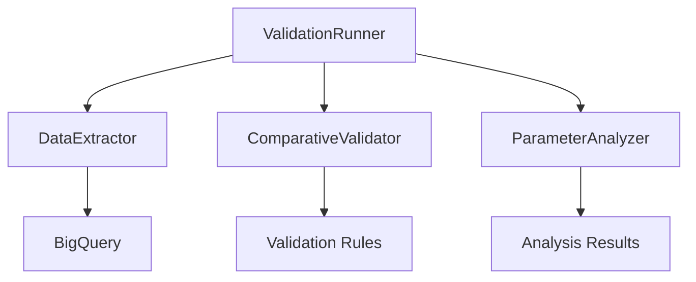

# Orchestration Component (run_validation.py)

## Overview
The orchestration component serves as the main entry point for the validation system, coordinating the execution of data extraction, validation, and analysis processes. It provides a unified interface for running the entire validation workflow with configurable options.

## Architecture

### Class Structure
```python
class ValidationRunner:
    """Main orchestration class for the validation workflow."""
    
    def __init__(self, config_path: Optional[str] = None):
        self.config = self._load_config(config_path)
        self.logger = self._setup_logging()
        self.extractor = None
        self.validator = None
        self.analyzer = None
```

### Component Integration


## Core Features

### 1. Workflow Management
```python
def run_workflow(self, old_version: str, new_version: str, **kwargs):
    """
    Executes the complete validation workflow.
    
    Steps:
    1. Extract data from BigQuery
    2. Run validation comparison
    3. Generate analysis reports
    4. Save results
    """
```

### 2. Configuration Management
```python
def _load_config(self, config_path: Optional[str]) -> Dict[str, Any]:
    """
    Loads and validates configuration settings.
    
    Priority:
    1. User-provided config file
    2. Environment variables
    3. Default settings
    """
```

### 3. Progress Tracking
```python
def track_progress(self, total_steps: int = 3):
    """
    Tracks and reports workflow progress.
    
    Features:
    - Step completion tracking
    - Time estimation
    - Resource monitoring
    - Error tracking
    """
```

## Command Line Interface

### Usage
```bash
# Basic usage
python run_validation.py --old-version 0.3615 --new-version 0.3621

# With custom configuration
python run_validation.py --config custom_config.json --old-version 0.3615 --new-version 0.3621

# Skip specific steps
python run_validation.py --skip-extraction --old-version 0.3615 --new-version 0.3621
```

### Arguments
```python
def parse_args():
    """
    Parses command line arguments.
    
    Arguments:
    --old-version: Old version number
    --new-version: New version number
    --config: Path to config file
    --skip-extraction: Skip data extraction
    --skip-analysis: Skip analysis phase
    --output-dir: Custom output directory
    """
```

## Configuration Options

### 1. Basic Configuration
```json
{
    "bigquery": {
        "project_id": "your-project",
        "dataset_id": "your-dataset",
        "table_id": "your-table"
    },
    "validation": {
        "chunk_size": 10000,
        "parallel_processing": true
    },
    "output": {
        "base_dir": "output",
        "save_intermediates": false
    }
}
```

### 2. Advanced Settings
```json
{
    "logging": {
        "level": "INFO",
        "format": "%(asctime)s - %(levelname)s - %(message)s",
        "file": "validation.log"
    },
    "performance": {
        "max_memory": "4G",
        "timeout": 3600,
        "retry_count": 3
    }
}
```

## Error Handling

### 1. Exception Hierarchy
```python
class ValidationError(Exception):
    """Base class for validation errors."""
    pass

class ConfigurationError(ValidationError):
    """Configuration-related errors."""
    pass

class ExecutionError(ValidationError):
    """Workflow execution errors."""
    pass
```

### 2. Error Recovery
```python
def handle_error(self, error: Exception, context: str):
    """
    Handles workflow errors with recovery options.
    
    Strategy:
    1. Log error details
    2. Attempt recovery
    3. Clean up resources
    4. Report status
    """
```

## Resource Management

### 1. Memory Management
```python
def manage_resources(self):
    """
    Manages system resources during execution.
    
    Features:
    - Memory monitoring
    - Garbage collection
    - Resource cleanup
    - Process management
    """
```

### 2. File Management
```python
def manage_files(self):
    """
    Manages temporary and output files.
    
    Tasks:
    - Create directories
    - Clean temporary files
    - Organize outputs
    - Handle permissions
    """
```

## Logging and Monitoring

### 1. Logging Setup
```python
def setup_logging(self):
    """
    Configures logging system.
    
    Features:
    - File logging
    - Console output
    - Error tracking
    - Performance metrics
    """
```

### 2. Progress Reporting
```python
def report_progress(self, step: str, progress: float):
    """
    Reports workflow progress.
    
    Metrics:
    - Step completion
    - Time elapsed
    - Memory usage
    - Error count
    """
```

## Integration Points

### 1. Input Integration
- Command line arguments
- Configuration files
- Environment variables
- API endpoints

### 2. Output Integration
- JSON reports
- CSV data files
- Log files
- Error reports

## Best Practices

### 1. Configuration
- Use environment-specific configs
- Validate all settings
- Document options
- Use secure storage

### 2. Error Handling
- Implement graceful degradation
- Provide clear error messages
- Log all failures
- Clean up resources

### 3. Performance
- Monitor resource usage
- Implement timeouts
- Use parallel processing
- Cache results

## Troubleshooting

### Common Issues
1. **Configuration Problems**
   - Missing credentials
   - Invalid settings
   - Path issues

2. **Resource Issues**
   - Memory exhaustion
   - Disk space
   - Timeouts

3. **Data Issues**
   - Invalid versions
   - Corrupt data
   - Missing files

## Development Guide

### 1. Adding New Features
```python
def add_workflow_step(self, step_name: str, handler: Callable):
    """
    Adds new workflow step.
    
    Requirements:
    - Implement handler interface
    - Add configuration
    - Update documentation
    - Add tests
    """
```

### 2. Testing
```python
def run_tests(self):
    """
    Runs test suite.
    
    Types:
    - Unit tests
    - Integration tests
    - Performance tests
    - Configuration tests
    """
```

## Deployment

### 1. Requirements
- Python 3.8+
- Required packages
- System resources
- Access credentials

### 2. Environment Setup
```bash
# Create virtual environment
python -m venv venv
source venv/bin/activate

# Install dependencies
pip install -r requirements.txt

# Configure credentials
export GOOGLE_APPLICATION_CREDENTIALS="path/to/credentials.json"
``` 