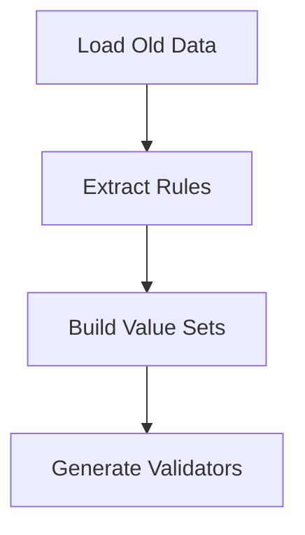
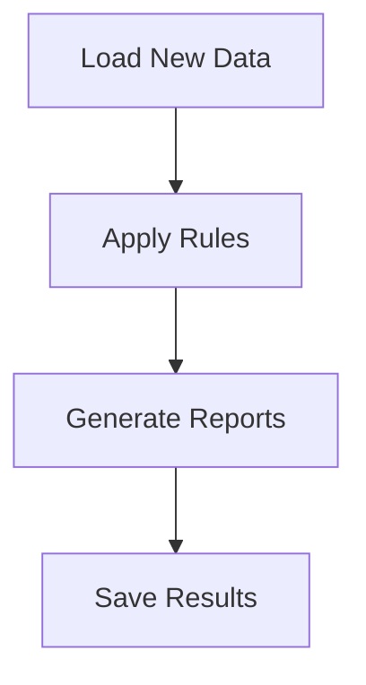

# Validation Component (compare_validate.py)

## Overview
The validation component implements comprehensive comparison and validation logic between two versions of game data. It uses a combination of rule-based validation, pattern matching, and statistical analysis to ensure data consistency and quality.

## Core Components

### 1. ComparativeValidator Class
The main class responsible for orchestrating the validation process.

```python
class ComparativeValidator:
    def __init__(self, old_csv_path: str, new_csv_path: str, chunk_size: int = 10000):
        self.old_csv_path = Path(old_csv_path)
        self.new_csv_path = Path(new_csv_path)
        self.chunk_size = chunk_size
        self.analyzer = ParameterAnalyzer(old_csv_path)
```

### 2. Validation Types

#### Value Set Validation
```python
def validate_value_set(self, column: str, value: Any) -> bool:
    """Validates values against known valid sets from old version."""
    return str(value) in self.value_sets[column]
```

#### Pattern Validation
```python
def validate_pattern(self, value: str, pattern: str) -> bool:
    """Validates string values against regex patterns."""
    return bool(re.match(pattern, str(value)))
```

#### Range Validation
```python
def validate_range(self, value: float, min_val: float, max_val: float) -> bool:
    """Validates numeric values within specified ranges."""
    return min_val <= value <= max_val
```

## Validation Rules

### 1. Timestamp Validation
Three formats supported:
```python
TIMESTAMP_VALIDATORS = {
    'iso': TimestampISOValidator(),
    'unix_ms': TimestampMillisValidator(),
    'unix_s': TimestampSecondsValidator()
}
```

### 2. JSON Structure Validation
```python
def validate_json_structure(self, value: str, schema: dict) -> bool:
    """
    Validates JSON structures against defined schemas.
    
    Example schema:
    {
        "type": "object",
        "properties": {
            "tap_count": {"type": "integer"},
            "target_path": {"type": "string"},
            "coordinates": {
                "type": "object",
                "properties": {
                    "x": {"type": "number"},
                    "y": {"type": "number"}
                }
            }
        }
    }
    """
```

### 3. List Validation
```python
def validate_list(self, value: str, allowed_values: Optional[Set] = None) -> bool:
    """
    Validates list structures and their elements.
    
    Examples:
    - Simple lists: ["value1", "value2"]
    - Nested lists: [{"id": 1, "value": "test"}]
    """
```

## Processing Flow

### 1. Analysis Phase


### 2. Validation Phase


## Performance Optimization

### 1. Memory Management
```python
def process_in_chunks(self, file_path: Path) -> Iterator[pd.DataFrame]:
    """Process large files in manageable chunks."""
    for chunk in pd.read_csv(file_path, chunksize=self.chunk_size):
        yield chunk
```

### 2. Parallel Processing
```python
def validate_chunk(self, chunk: pd.DataFrame) -> Dict[str, List[ValidationError]]:
    """Validate data chunk using parallel processing."""
    with concurrent.futures.ThreadPoolExecutor() as executor:
        futures = [executor.submit(self.validate_row, row) 
                  for _, row in chunk.iterrows()]
```

## Error Handling

### 1. Validation Errors
```python
class ValidationError:
    def __init__(self, column: str, value: Any, error_type: str, message: str):
        self.column = column
        self.value = value
        self.error_type = error_type
        self.message = message
```

### 2. Error Categories
- Type Mismatches
- Range Violations
- Pattern Mismatches
- Structure Violations
- Missing Required Fields

## Reporting

### 1. Summary Report
```python
def generate_summary(self) -> Dict[str, Any]:
    """Generate validation summary statistics."""
    return {
        'total_rows_processed': self.total_rows,
        'valid_rows': self.valid_count,
        'invalid_rows': self.invalid_count,
        'error_distribution': self.error_counts,
        'validation_duration': self.duration
    }
```

### 2. Detailed Report
```python
def generate_detailed_report(self) -> Dict[str, Any]:
    """Generate detailed validation report with examples."""
    return {
        'column_statistics': self.column_stats,
        'error_examples': self.error_examples,
        'value_distributions': self.distributions
    }
```

### 3. Comparative Summary Reports
The validation system generates two comparative summary reports:

#### Full Summary (`comparative_summary_YYYYMMDD_HHMMSS.json`)
Contains validation results for all parameters, including those with no validation issues.

#### Main Summary (`comparative_summary_main_YYYYMMDD_HHMMSS.json`)
Contains only parameters that have invalid examples, filtering out parameters with 100% valid data. This focused report:
- Reduces noise from parameters with no issues
- Highlights parameters requiring attention
- Provides actionable insights for data quality improvement
- Makes it easier to prioritize validation failures

```python
def save_validation_results(self):
    """Save both full and filtered validation results."""
    # Filter for main report (only parameters with invalid examples)
    main_results = {
        param: data for param, data in final_results.items()
        if data['invalid_examples'] is not None
    }
```

## Integration

### 1. Input Requirements
- Old version CSV file
- New version CSV file
- Configuration settings
- Custom validation rules (optional)

### 2. Output Format
- Validation summary (JSON)
- Detailed report (JSON)
- Log file (TEXT)
- Error examples (CSV)

## Best Practices

### 1. Data Validation
- Always validate input data types
- Handle missing values appropriately
- Use appropriate comparison methods for different data types

### 2. Error Handling
- Provide clear error messages
- Include context in error reports
- Track error patterns

### 3. Performance
- Use appropriate chunk sizes
- Implement parallel processing where beneficial
- Monitor memory usage

## Configuration Options

### 1. Validation Settings
```json
{
    "validation": {
        "chunk_size": 10000,
        "parallel_processing": true,
        "error_limit": 1000,
        "strict_mode": false
    }
}
```

### 2. Custom Rules
```python
CUSTOM_VALIDATORS = {
    'timestamp_client': TimestampClientValidator(),
    'click_on_screen': ClickEventValidator(),
    'active_segments': ConfigValidator()
}
```

## Troubleshooting

### Common Issues
1. Memory Errors
   - Reduce chunk size
   - Enable garbage collection
   - Monitor memory usage

2. Performance Issues
   - Optimize validation rules
   - Use parallel processing
   - Implement caching

3. Data Quality Issues
   - Validate input data
   - Handle edge cases
   - Implement data cleaning 